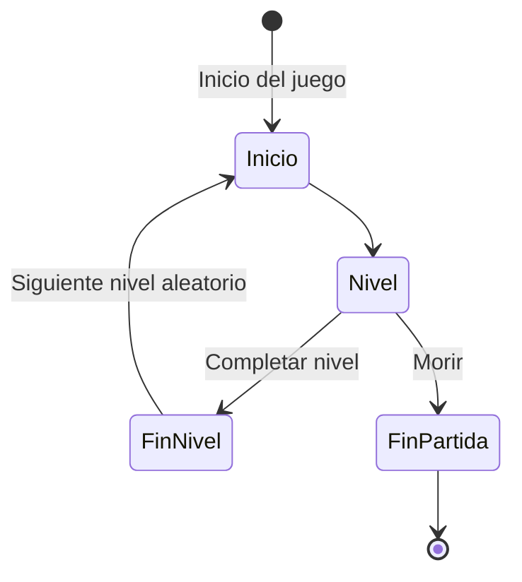
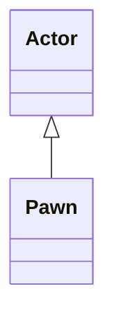

# DEV24-Gherasim
Práctica final de la asignatura Desarrollo de Videojuegos del Master en Ingeniería Informática de la Universidad Complutense de Madrid.\
Nombre provisional:\
MISIÓN RICARDO - An Enrique Amarillo Game
## Instalación y uso
Para probar el juego basta con descargarse el ejecutable de la sección de Releases.

Para poder abrir el proyecto en Unreal hace falta descargarse la carpeta Content e incluirla en la raíz del proyecto. Si se tiene permiso, es posible descargarla [aquí](https://drive.google.com/drive/folders/1LQDp10OADjGn19CfKLdQe51aLd76DkXS?usp=sharing).

### Controles
Los controles del juego son los siquientes:
- Movimiento: WASD.
- Saltar: Barra espaciadora.
- Cambiar de arma: Rueda del ratón.
- Apuntar: Movimiento del ratón.
- Disparar: Click izquierdo.

## Preproducción
El juego será un shooter en primera persona con mecánicas rogue-like basado en la popular franquicia multimedia [Enrique Amarillo](https://www.youtube.com/@enriqueamarillo7126).

### Historia
Eres Ricardo, el mejor cadete de la academia militar del ejército anti-Enrique. Ante ti está tú último desafío para poder graduarte e ir de una vez por todas a acabar con el condenado Enrique Amarillo. Ayudandose de la última tecnología disponible en Persépolis, *El Puto Amo* ha creado un simulador de combate de última generación para que sepas como efrentarte a Enrique Amarillo y sus allegados cuando llegue el momento decisivo. Aguanta todo lo que puedas y demuestra que la cera es capaz de salir del oído.

Las características principales serán:\
A- El jugador deberá superar niveles para progresar en el juego. Estos niveles consistirán de un mapa por el que poder moverse libremente y varias oleadas de enemigos a eliminar. El jugador se enfrentará a los enemigos haciendo uso de distintas armas con las que podrá disparar a estos.\
B- El jugador podrá elegir entre varias armas disponibles en su inventario. Cada arma hará un tipo de daño y los enemigos serán débiles o resistentes a estos tipos. Será necesario aprovechar estas características para triunfar en combate y superar los niveles. En ocasiones determinadas el jugador obtendrá mejoras para las armas que aumentarán las características de estas.\
C- El jugador irá acumulando experiencia conforme vaya eliminando enemigos y cuando reuna la suficiente subirá de nivel. Al subir de nivel mejorarán las características del jugador como la vida o el daño que inflige.\
D- Los mapas, enemigos, mejoras de armas y mejoras de características del personaje serán aleatorias. Cuando se empiece un nuevo nivel el mapa donde se jugará, el tipo de enemigos y el modo de juego se determinarán de manera aleatoria. Al subir de nivel el personaje podrá elegir entre varios atributos aleatorios a mejorar y de igual manera sucederá con las armas.
## Punto de partida
Como punto de partida para esta práctica se usará la plantilla **First Person** de Unreal Engine 5.

## Estética
Los escenarios y los enemigos del juego estarán basados en ubicaciones y personajes de la serie. 

## Gráficos
En un principio se utilizará la plantilla **First Person** de Unreal Engine para el personaje principal, el paquete **Starter Content** para los niveles, la plantilla **Third Person** para los enemigos y los siguientes recursos de **Fab**: [Animation Starter Pack](https://fab.com/s/5b8a9c9d3c77) y [Dr. infinity's mage animation set.](https://fab.com/s/55e3cb581e60) para las animaciones de los enemigos.\
Cualquier otro asset utilizado se añadirá en futuras actualizaciones del readme

## Sonidos
El juego tendrá musica de fondo, aunque la canción está aún por determinar. Posiblemente cada mapa tenga una canción diferente.

Habrá efectos de sonido que sonarán al realizar alguna de las siguientes acciones:
- Disparar cada tipo de arma
- Subir de nivel
- Obtener mejora del arma
- Ruidos de los enemigos

Una vez estén escogidos los efectos de sonido concretos se documentarán aquí en futuras actualizaciones del readme.
## Dinámica 
La dinámica principal del juego ir matando enemigos para conseguir mejoras e ir avanzando niveles.

### Objetivo
El objetivo del juego es sobrevivir el mayor tiempo posible. Para ello el jugador debe eliminar a los enemigos de cada nivel sin perder toda su vida. Para hacer esto más fácil irán mejorando sus características al subir de nivel.
### Castigo
Si el jugador no supera el nivel porque es derrotado por los enemigos la partida acabará y deberá empezarse otra vez desde el principio.
## Contenido
El contenido del juego es el siguiente:
### Avatar
El avatar del juego es el maniquí por defecto de Unreal que en esta aventura encarnará a Ricardo.
### Armas
Ricardo como buen graduado de Estudios Pacifistas por la universidad de Wisconsin es un maestro en el manejo de todo tipo de rifles.
#### Rifle normal
El rifle por defecto de Ricardo, lo tiene desde que se lo regalaron con 12 años en Navidad. Inflige daño contudente a los enemigos. Si se mejora lo suficiente podrá hacer golpes críticos e infligir el doble del daño normal a los enemigos.
#### Rifle de fuego
Se dice que este rifle nació por reproducción autótrofa en el lejano planeta Marte. Nadie sabe como ha llegado a manos de Ricardo pero eso ya es trabajo de los guionistas. Inflige daño de fuego a los enemigos. Si se mejora lo suficiente causará quemaduras a los enemigos, inflingiendoles daño a lo largo del tiempo.
#### Rifle de rayos
El puto amo fabricó este rifle entre que veía las noticias y dejaba de verlas. Después de su muerte la interacción con cierto triángulo amarillo lo dotó de poderes eléctricos. Inflige daño de electricidad a los enemigos. Si se mejora lo suficiente paralizará a los enemigos durante unos segundos.
#### Rifle verde claro
Tras pasar por el infierno de un pez flaco este rifle obtuvo el poder de la vergononzoia. Inflige daño de tipo *la hostia* en un área. Si se mejora lo suficiente creará una área de gravedad en la zona que impacte la bala que atraerá a los enemigos hacia ella.
### Enemigos
En esta misión Ricardo deberá cargarse a todos los Enriques que pueda entre ellos:
#### Enrique Amarillo
*Ýpsilon* Enrique Amarillo ha sido catalogado como una amenaza por tu superior Frank, debes acabar con el cueste lo que cueste. Enrique Amarillo es el enemigo básico, es débil al daño de rayo.
#### Enrique Rojo
*No tan rápido... Pistón* Esta versión de Enrique utiliza la reproducción autótrofa para generar clones ilusorios de si mismo, acaba con el antes de que te sobrepasen. Débil al daño de fuego.
#### Enrique Verde
*Xbox, desachtviar alarma* Este clon de Enrique Verde Supremo no dudará en ir a por tí para proteger a su líder y defender su base.Es débil al daño *la hostia*.

### Mapas
El juego tendrá varios mapas por donde el jugador podrá moverse libremente mientras acaba con los enemigos. De momento se plantean estos mapas:
- Detroit: Mapa simple al aire libre.

- Base Enrique Verde: En este mapa Enrique Tanque apoyará a los enemigos disparando obuses.

- Museo de los Enriques: Mapa compartimentado en diferentes salas donde habrá que evitar ser acorralado por los enemigos

## Producción
| Estado  |  Tarea  |  Fecha  |  
|:-:|:--|:-:|
| ✔ | Diseño: Primer borrador | 27-12-2024|

Como lista de mecánicas implementadas podría expresarse así:
- [x] Mecánica: Descripción

Las clases principales que se han desarrollados son las siguientes:

## Posproducción
La posproducción ha consistido en la creación del ejecutable del juego, disponible en la sección **Releases** junto con la grabación de un [vídeo]() de demostración en el que se puede ver como superar el juego.

## Licencia
Iulius Gherasim, autor de la documentación, código y recursos de este juego, concedo permiso permanente a los profesores de la Facultad de Informática de la Universidad Complutense de Madrid para utilizar nuestro material, con sus comentarios y evaluaciones, con fines educativos o de investigación; ya sea para obtener datos agregados de forma anónima como para utilizarlo total o parcialmente reconociendo expresamente nuestra autoría.

Una vez superada con éxito la asignatura se prevee publicar todo en abierto (la documentación con licencia Creative Commons Attribution 4.0 International (CC BY 4.0) y el código con licencia GNU Lesser General Public License 3.0).

## Referencias
Las principales referencias del juego son:
- [Enrique Amarillo](https://www.youtube.com/@enriqueamarillo7126/featured), Ypsilon Studios, 2018
- [Doom](https://es.wikipedia.org/wiki/Doom_(franquicia)), ID Software, 1993
- [Rogue](https://en.wikipedia.org/wiki/Rogue_(video_game)), A.I. Design, 1980
- [Vampire Survivors](https://poncle.itch.io/vampire-survivors), Poncle, 2021
- [Call of Duty: Black Ops - Zombies](https://es.wikipedia.org/wiki/Call_of_Duty:_Black_Ops#Modo_Zombies), Treyarch, 2010